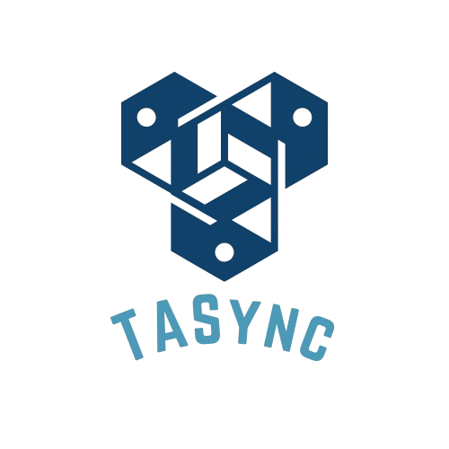

# TASync

**TASync** is a command-line application designed to help teaching assistants (TAs) and tutors efficiently manage their administrative tasks and personal workload. Whether it's tracking attendance, recording remarks, or planning tutorials, TASync provides a streamlined solution that automates time-consuming tasks, allowing users to focus on what truly matters – helping students succeed.

 ---

Useful links:
* [User Guide](UserGuide.md)
* [Developer Guide](DeveloperGuide.md)
* [About Us](AboutUs.md)
